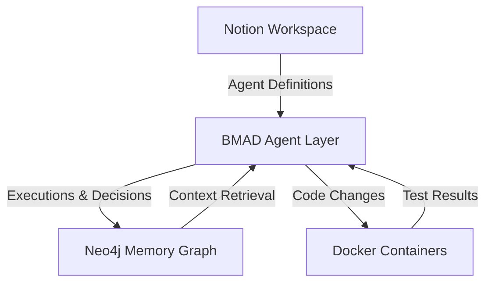

# BMAD-METHOD Custom: Notion-Driven AI Development

> **Breakthrough Method for Agile AI-Driven Development**  
> A production-ready fork integrating **Notion as source of truth** and **Neo4j as persistent memory**, enabling AI agents to build, plan, and ship software collaboratively.

[](LICENSE)
[](https://www.docker.com/)
[](https://www.notion.so/)
[](https://neo4j.com/)

---

## 🏗️ Architecture Overview

This fork transforms BMAD into a **dual-system architecture**:

- **Notion Layer**: Living documentation, agent personas, workflows, and project context
- **Neo4j Layer**: Graph-based memory for relationships, decisions, and historical patterns
- **Agent Orchestra**: 10+ specialized AI agents collaborating across planning, execution, and support domains

**Design Philosophy**: Every system is an ecosystem. User journeys define boundaries, contracts define handoffs, and memory enables learning.

---

## 🎯 Why This Fork?

| Feature | Standard BMAD | This Fork |
|---------|---------------|-----------|
| **Source of Truth** | File-based configs | Notion workspace |
| **Memory** | Session-only | Persistent Neo4j graph |
| **Agent Coordination** | Manual prompts | Workflow automation |
| **Documentation** | Static markdown | Living Notion pages |
| **Scalability** | Single-project | Multi-project with shared memory |

---

## 🚀 Quick Start

### Choose Your Path

**👤 For New Projects**
```bash
git clone https://github.com/Charitablebusinessronin/BMAD-METHOD_custom.git
cd BMAD-METHOD_custom
# Follow: docs/INSTALL-NEW-FOLDER.md
```

**📦 For Existing Projects**
```bash
# Copy _bmad/, .cursor/, and docs/ into your project root
# Configure: _bmad/core/config.yaml and _bmad/bmm/config.yaml
# Follow: README-FORK-SETUP.md
```

**📋 Prerequisites**
- Docker (required—we build and test exclusively in containers)
- Notion account + API key
- Neo4j instance (local or cloud)
- Cursor/VS Code with AI extensions

---

## 👥 Agent Ecosystem

### Planning Team
- **Jay** (Product Manager): Requirements gathering, user stories
- **John** (Project Manager): Sprint planning, task decomposition
- **Winston** (Architect): System design, technical decisions

### Execution Team
- **Bob** (Backend Engineer): API development, database design
- **Brooks/Barry** (DevOps/QA): Docker, CI/CD, testing
- **Troy** (Frontend Engineer): UI/UX implementation

### Support Team
- **Allura**: Code review, quality standards
- **Paige**: Documentation, knowledge management
- **Dr. Quinn**: Technical research, problem-solving
- **Sarah Boone**: Data analysis, reporting

Each agent lives in Notion with full persona, communication style, and workflow documentation.

---

## 📚 Documentation Hub

### Getting Started
- [**Installation Guide**](docs/INSTALL-NEW-FOLDER.md) - Step-by-step setup for new and existing projects
- [**Fork Setup**](README-FORK-SETUP.md) - Configuration and customization options

### Architecture & Integration
- [**Notion + Neo4j Integration**](docs/NOTION-AND-NEO4J-INTEGRATION.md) - How the dual-layer system works
- [**Memory Schema**](docs/memory-schema.md) - Graph database structure and relationships
- [**Method Overview**](docs/NOTION-METHOD-OVERVIEW.md) - BMAD workflow in Notion

### Advanced Topics
- **API Reference**: `_bmad/core/` and `_bmad/bmm/` modules
- **Custom Agents**: Extending the team with your own specialists
- **Multi-Project Mode**: Sharing memory across repositories

---

## 🔧 Technology Stack



**Core Integrations**
- **Notion API**: Real-time sync of agent personas, workflows, and project data
- **Neo4j Graph DB**: Persistent memory for relationships, patterns, and history
- **Docker**: Isolated build and test environments (no local pollution)
- **Cursor/AI IDEs**: Seamless agent collaboration in your editor

---

## 🤝 Contributing

This is a personal fork optimized for Notion-driven workflows. If you'd like to:
- **Report issues**: Open a GitHub issue with steps to reproduce
- **Suggest features**: Describe the use case and architectural impact
- **Submit PRs**: Ensure Docker builds pass and include tests

---

## 📄 License

This fork maintains the original BMAD-METHOD license. See [LICENSE](LICENSE) for details.

---

## 🔗 Links

- **Original BMAD Method**: [bmad-code-org/BMAD-METHOD](https://github.com/bmad-code-org/BMAD-METHOD)
- **Notion Template** *(coming soon)*: Pre-configured workspace for agent teams
- **Live Example** *(private)*: Production usage in my projects

---

**Built with 🏗️ by Winston & the BMAD Agent Team**
